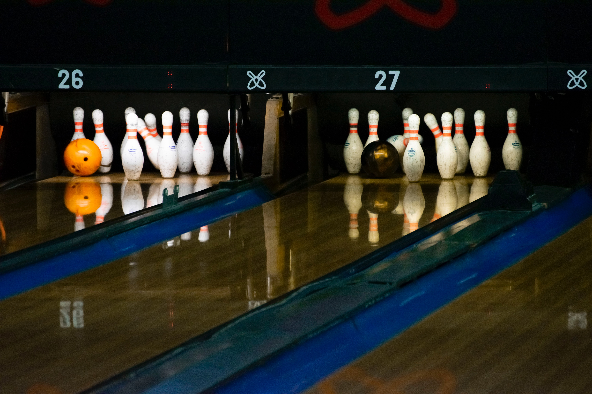

# The Bowling Game Kata

- The game consists of 10 frames as shown above. In each frame the player has two opportunities to knock down 10 pins. The score for the frame is the total number of pins knocked down, plus bonuses for strikes and spares.
- A spare is when the player knocks down all 10 pins in two tries. The bonus for that frame is the number of pins knocked down by the next roll. So in frame 3 above, the score is 10 (the total number knocked down) plus a bonus of 5 (the number of pins knocked down on the next roll.)
- A strike is when the player knocks down all 10 pins on his first try. The bonus for that frame is the value of the next two balls rolled.
- In the tenth frame a player who rolls a spare or strike is allowed to roll the extra balls to complete the frame. However no more than three balls can be rolled in tenth frame.

### NOTAS
- Los datos para el juego de pueden ingresar de manera manual, aleatoria o algúna otra forma
- No es necesario implementar una GUI puede ser una aplicación de consola

## Instrucciones
- Tienes 3 días para implementar el algortitmo de el Juego de Boliche
- Lo harás en entregas parciales realizando PULL REQUESTS
  - Cada pull request debe incluir una funcionalidad
  - Los commits deben ser significativos
  - Debes compartir en #support tus pull requests para que los mentores te hagan code review
  - Se requiere por lo menos la aprobación de 1 mentor para hacer merge
- NO es un examen sino un ejercicio por lo que puedes apoyarte en tus compañeros y mentores para recibir ayuda, así que si tienes dudas, pregunta, pregunta pregunta!

## Entregable
Una implementación completa y funcional del juego del boliche, la implementación deberá
- Utilizar el lenguaje Ruby
- Estar en el repositorio de github que nosotros te asignaremos
- Tener todos los pull requests aprobados por por lo menos 1 mentor
- Ser completamente orientada a objetos
- Incluir pruebas (TDD)

## Enlaces
- [The (written) unwritten guide to pull requests](https://www.atlassian.com/blog/git/written-unwritten-guide-pull-requests)
- [Best practices for pull requests](https://github.community/t/best-practices-for-pull-requests/10195)
- [BEST PRACTICES ON DOING PULL REQUESTS](https://holgerfrohloff.de/best-practices-on-doing-pull-requests/)
- [What every reviewer would like to see in your next Pull Request](https://nebulab.it/blog/what-every-reviewer-would-like-to-see-in-your-next-pull-request/?utm_content=bufferbd023&utm_medium=social&utm_source=twitter.com&utm_campaign=buffer)
- [Coding Dojo: Bowling](https://codingdojo.org/kata/Bowling/)
